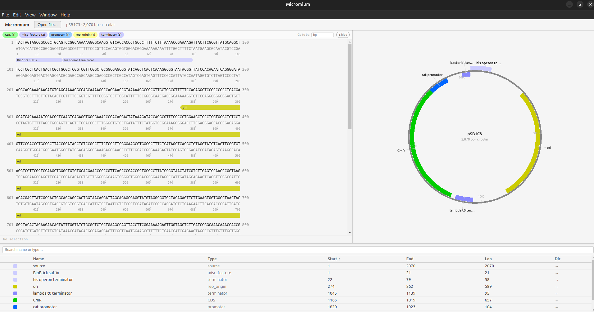
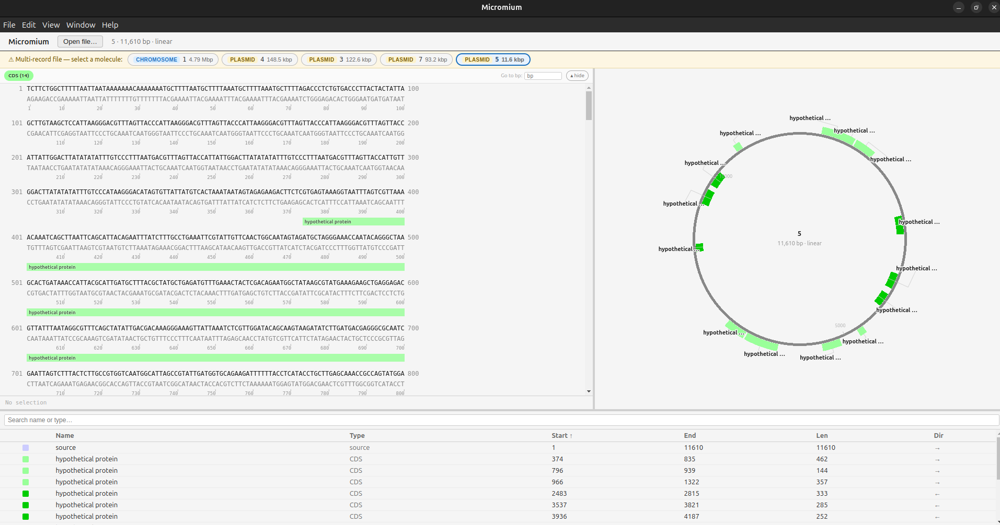
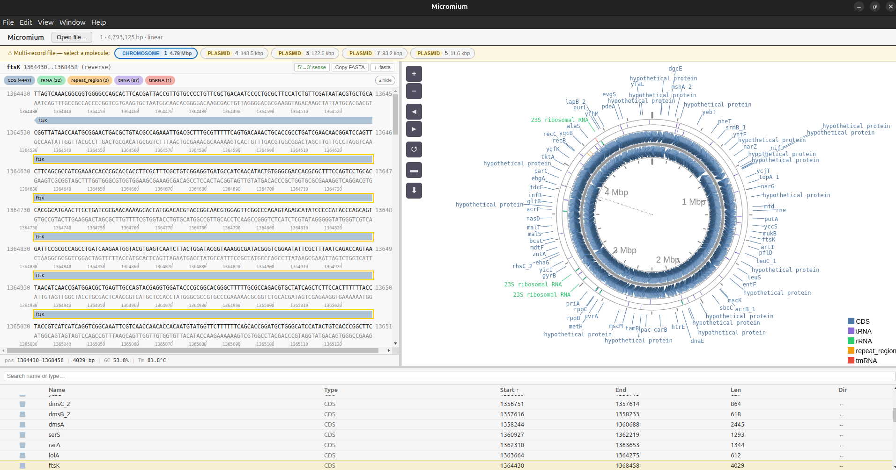
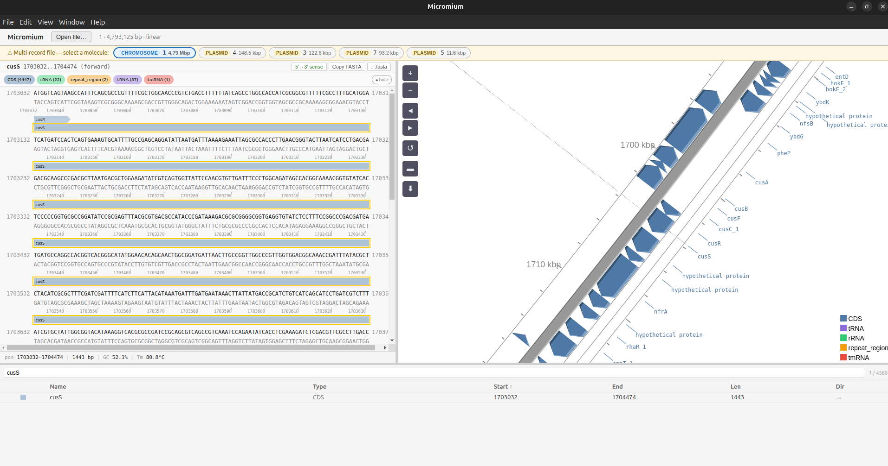

# Micromium

A cross-platform plasmid and genome viewer for GenBank files, inspired by
[ApE (A Plasmid Editor)](https://jorgensen.biology.utah.edu/wayned/ape/).
Built in Go with an Electron frontend.

[](https://doi.org/10.5281/zenodo.19225286)


> **Early release.** Core viewing works. Editing and saving are not yet implemented — feedback and bug reports are very welcome.

---

## What it does

- Opens GenBank (`.gb`, `.gbk`) and FASTA files via native file dialog
- **Plasmid mode** (< 20,000 bp): circular map with feature arcs, tooltips, tick marks
- **Genome mode** (≥ 20,000 bp): interactive CGView.js viewer with zoom, rotate, linear/circular toggle
- Sortable feature table with cross-highlighting between views
- Sequence panel with GC%, Tm, FASTA export, and **in-line translation** (plasmid and genome mode)
- **Translation** uses NCBI Table 11 (Bacterial, Archaeal and Plant Plastid Code) with alternate start codon awareness (GTG, TTG, CTG, ATT, ATC, ATA → fMet)
- **Dark mode** toggle with persistent preference

---

## Prerequisites

| Tool | Version | Check |
|------|---------|-------|
| Go | 1.22+ | `go version` |
| Node.js | 18+ | `node --version` |
| npm | 9+ | `npm --version` |

---

## Quick start

### Linux

```bash
git clone git@github.com:RENAISSANCE-UIC/micromium.git
cd micromium
./build/dev.sh
```

`dev.sh` installs Node deps, builds the frontend, compiles the Go server, and launches Electron.

> **Note:** On most Linux systems Electron requires `--no-sandbox`. This flag is already set in `dev.sh`.
> If you get a sandbox error, make sure you're running `./build/dev.sh` rather than invoking Electron directly.

### Windows

1. Go to the **Actions** tab of this repository on GitHub
2. Click the most recent passing workflow run
3. Scroll to the bottom and download the **`micromium-windows-installer`** artifact
4. Unzip and run the `.exe` — Windows will install Micromium and create a Start Menu shortcut

> **Windows SmartScreen warning:** The installer is not yet code-signed, so Windows will show a blue "Windows protected your PC" dialog. Click **More info → Run anyway** to proceed. This is expected for now.

> **IMPORTANT:** We need you to test this out and get back to us. We are going to be filing an application for [SignPath](https://signpath.org/) and this helps us make the case for the Reputation criterion. Verabatim, these are:
 
"Describe how we can verify that your project is used and trusted. 
Provide sources and links including 
* Media reports 
* Blog articles 
* Wikipedia articles in other languages (see below for English), Softpedia etc. 
* Usage data such as number of downloads, forks or dependencies 
* Analysis such as GitHub Insights 
* Proof of Trademark ownership if you're using a trademarked name 
If available, we will also look at the English Wikipedia article and OpenHub (see below), and community data such as GitHub Insights."

 
 
> Artifacts expire after 90 days. If none is available, open an issue and we'll post a fresh build.

---

## Test files

A set of ATCC reference genomes and plasmids is included in `testdata/`:

**Plasmids**

| File | Size | Notes |
|------|------|-------|
| `pSB1C3.gb` | 2,070 bp | iGEM BioBrick backbone |
| `pSB1C3_I0500_LasI.gb` | ~5 kb | BioBrick with LasI insert |

**Microbial genomes + associated plasmids**

| Organism | Chromosome file | Plasmid files |
|----------|----------------|---------------|
| *E. coli* K-12 MG1655 | `Ecoli_K12_MG1655.gbk` | — |
| *E. coli* NIST 0056 | `Ecoli_NIST0056.gbk`, `Ecoli_NIST0056_pgap.gbk` | `Ecoli_NIST0056 plasmid unnamed1–4.gbk` |
| *S. aureus* ATCC 25923 | `Saureus_ATCC25923.gbk` | `Saureus_ATCC25923_plasmidS1945.gbk` |
| *K. pneumoniae* ATCC 13883 | `Kpneumo_ATCC13883.gbk` | `pKPHS1–6.gbk` |
| *Enterococcus* ATCC 13047 | `Enteroc_ATCC13047.gbk` | `pECL_A.gbk`, `pECL_B.gbk` |

Open any file via **File → Open** in the app.

---

## Screenshots

**Plasmid mode** — circular map, sequence panel, and feature table





**Genome mode** — CGView circular viewer with feature legend



**Genome mode** — linear zoomed view



---

## What to try

- Open `pSB1C3.gb` and hover over feature arcs — tooltip shows label, coords, type
- Click a feature arc → the feature table highlights the same row
- Click a row in the feature table → the circular map highlights the arc
- Click a CDS feature in the sequence panel, then click **Protein** in the HUD → see the translated amino acid sequence; alternate start codons are flagged
- Toggle the **5′→3′ sense / 3′→5′ RC** button while the protein panel is open — translation updates live
- Open `Ecoli_NIST0056.gbk` → genome mode loads with CGView; zoom and rotate work
- Click a CDS arc in genome mode → feature table cross-highlights; click **Protein** in the sequence panel header to translate
- Click **Dark mode** in the top-right of the header to switch themes; preference is saved across sessions
- Open any plasmid file from the `testdata/` folder to see the circular viewer

---

## Known limitations (alpha)

- **Read-only.** No saving, no feature editing, no copy/paste yet.
- The app is in active development — some rough edges are expected.
- Sequence panel is blank in genome mode (bases are omitted for large files by design).

---

## Project layout

```
bio/            Pure domain logic (sequence, features, GenBank parser)
app/            Application state + event bus
server/         HTTP + WebSocket API
frontend/       Electron + React + TypeScript
cmd/micromium/  Go entry point
testdata/       Sample GenBank files (plasmids + ATCC reference genomes)
build/          dev.sh (Linux), build.sh, build-windows.ps1
```

---

## Feedback

File issues or ping the author directly. This is pre-release — rough edges are expected.
